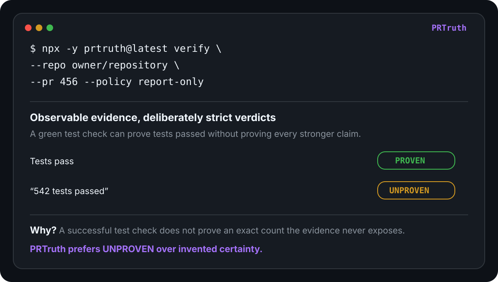

# PRTruth demo

PRTruth answers a narrow question: **does the evidence around a pull request actually support what the pull request says is done?**

This walkthrough is intentionally repository-neutral so you can apply the same steps to any public pull request you want to inspect.



## 1. Run PRTruth without installing it

Pick a public pull request and start with `report-only` so an `UNPROVEN` result does not fail your shell command:

```bash
npx -y prtruth@latest verify \
  --repo owner/repository \
  --pr 456 \
  --policy report-only
```

No GitHub token is required for a basic public-repository check.

If the pull request closes exactly one issue, PRTruth can infer that issue automatically. Otherwise provide it explicitly:

```bash
npx -y prtruth@latest verify \
  --repo owner/repository \
  --issue 123 \
  --pr 456 \
  --policy report-only
```

## 2. Read the result as evidence, not a score

PRTruth uses three deliberately strict states:

- `PROVEN` — observable evidence supports the requirement or claim.
- `FAILED` — observable evidence contradicts it or a required check failed.
- `UNPROVEN` — the available evidence is not strong enough to decide.

For example, imagine an issue contains these acceptance criteria:

```text
- Export endpoint exists
- Only admins can export
- Tests pass
- No breaking changes
```

A PR says all four are complete, while GitHub exposes a successful test check. A conservative report can look like this:

```text
Requirement                         Result
────────────────────────────────────────────
Export endpoint exists             ⚠ UNPROVEN
Only admins can export             ⚠ UNPROVEN
Tests pass                          ✓ PROVEN
No breaking changes                ⚠ UNPROVEN

Verdict: NOT PROVEN
```

The successful test check is good evidence that the observed tests passed. It is not automatically proof of authorization behavior, API compatibility, hidden runtime behavior, or any claim the check did not actually demonstrate.

PRTruth prefers `UNPROVEN` over invented certainty.

## 3. Try claims with different evidence strength

Useful pull requests often mix claims that GitHub can prove directly with claims that need stronger evidence.

Examples:

```text
Tests pass
542 tests passed
Lint passes on Node 22 and Node 24
No breaking changes
```

The evidence boundary matters:

- a successful test check can support `Tests pass`;
- it does not prove the exact number `542` unless that value is observable in the evidence;
- a Node 22 + Node 24 claim needs observable evidence for both lanes;
- ordinary green CI does not prove `No breaking changes`;
- an audit being green does not prove a stronger clause such as “with an empty exception set” unless that empty state is observable;
- a green coverage lane does not prove an unchanged numeric baseline unless the baseline/value is observable;
- current-head green CI does not prove a historical clause such as “this regression failed before the fix” unless before-state evidence is observable;
- generic install/build checks do not prove an installer-specific or packaged-runtime claim such as NSIS-installed or `win-unpacked` behavior;
- if a claim explicitly names specialized validation sub-scopes such as fault-injection and concurrency testing, each named sub-scope needs directly matching successful execution evidence; a partial resilience lane plus unrelated green tests is not enough.

This is the core PRTruth behavior to look for when evaluating it on your own repositories.

## 4. Add PRTruth to GitHub Actions

Start in non-blocking mode:

```yaml
name: PRTruth

on:
  pull_request:
    types: [opened, synchronize, reopened, edited]

permissions:
  contents: read
  issues: read
  pull-requests: read
  checks: read
  actions: read

jobs:
  verify:
    runs-on: ubuntu-latest
    steps:
      - uses: eissasoubhi/PRTruth@v0.1.22
        with:
          pr: ${{ github.event.pull_request.number }}
          policy: report-only
```

Observe reports on real pull requests first. Then move to `failures-only` or `strict` only if that fits your merge policy:

```text
report-only → observe real reports → failures-only → strict
```

## 5. Generate machine-readable evidence

```bash
npx -y prtruth@latest verify \
  --repo owner/repository \
  --pr 456 \
  --policy report-only \
  --format json \
  --output prtruth.json
```

PRTruth can also produce terminal, Markdown, and badge output.

Machine-readable output is useful when you want to archive verification evidence, feed it into another review tool, or build a merge/release policy around PRTruth without scraping terminal text.

## 6. What to look for during evaluation

A useful PRTruth trial should include more than a happy path. Try PRs with:

- a green test or build claim that should be `PROVEN`;
- an exact quantitative claim whose value is not visible and should remain `UNPROVEN`;
- an explicitly failed matching check that should be `FAILED`;
- a historical red-first claim where only post-fix CI is visible and should remain `UNPROVEN`;
- a strengthened validation claim such as an empty exception/suppression state or unchanged numeric baseline where the stronger state/value is not observable;
- a compound specialized-validation claim where one named sub-scope is skipped and should prevent `PROVEN`;
- a platform, runtime, browser, service, packaged-installer, or named-tool claim where one lane is missing;
- a broad business/runtime claim that CI does not deterministically prove.

That gives you a much better signal than testing only a PR where everything is green.

## Why the demo stays conservative

This page intentionally does not turn relevant diff lines, textual similarity, or hidden commands into proof. The public walkthrough and the verifier are held to the same evidence standard.

## Next steps

- Follow the [GitHub Actions quickstart](github-actions.md).
- See the [AI coding-agent workflow playbook](agent-workflows.md).
- Read [How PRTruth works](how-it-works.md) for the evidence model and current limitations.
